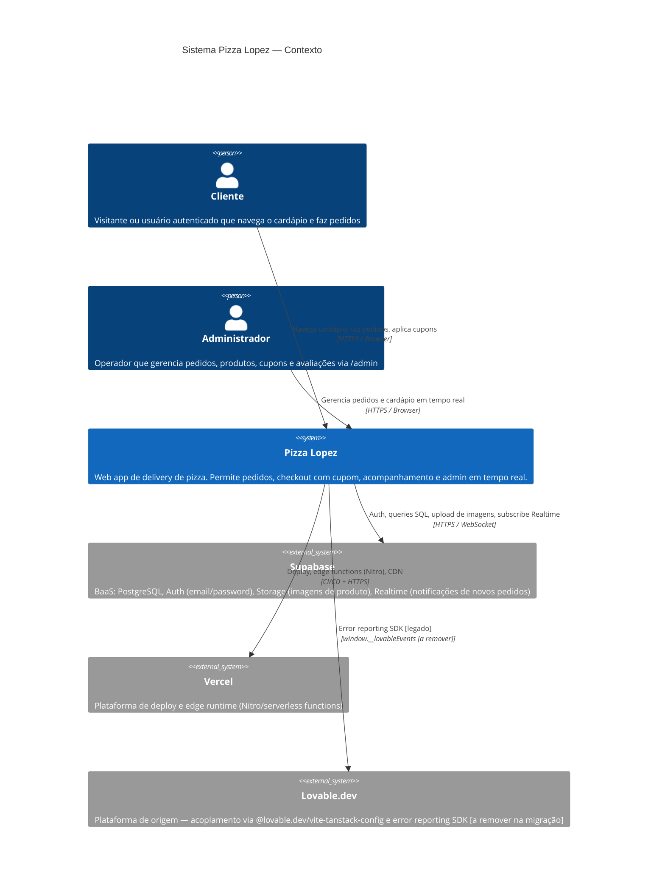
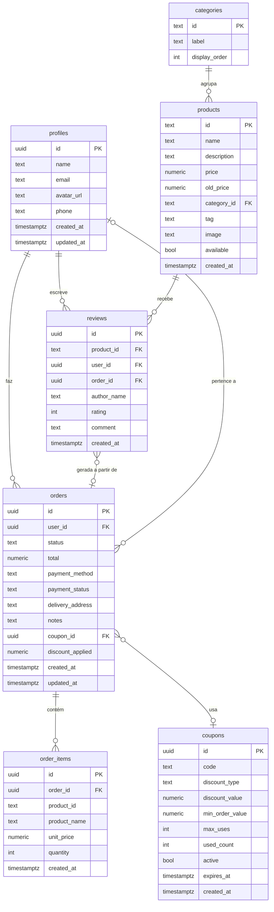

# Architecture — Pizza Lopez

> Gerado pelo Architect em 2026-06-08
> doc_level: essencial

## Escala de confiança
- 🟢 CONFIRMADO | 🟡 INFERIDO | 🔴 LACUNA

---

## 1. Visão Geral

**Pizza Lopez** é um e-commerce de delivery de pizza operando em Osasco/SP. É uma SPA com SSR construída em TanStack Start, hospedada na Vercel, com Supabase como BaaS exclusivo (autenticação, banco de dados PostgreSQL, Storage de imagens e Realtime).

| Atributo | Valor |
|----------|-------|
| Tipo | Web App (SPA + SSR) |
| Framework | TanStack Start 1.167 + TanStack Router (file-based) |
| Runtime | Nitro (preset Vercel) |
| UI | React 19 + Tailwind CSS 4 + shadcn/ui |
| Backend | Supabase (PostgreSQL + Auth + Storage + Realtime) |
| Deploy | Vercel |
| Linguagem | TypeScript |
| Gerenciador de pacotes | Bun |

---

## 2. C4 — Diagrama de Contexto (Nível 1)



---

## 3. Containers (resumo textual — essencial)

| Container | Tecnologia | Responsabilidade |
|-----------|-----------|-----------------|
| **Browser App** | React 19 + TanStack Router | UI, carrinho client-side, roteamento |
| **SSR Server** | Nitro + TanStack Start | Server functions (RPC), renderização SSR, middleware de auth |
| **Supabase DB** | PostgreSQL + RLS | Persistência de todos os dados |
| **Supabase Auth** | GoTrue | Autenticação JWT |
| **Supabase Storage** | S3-compatible | Imagens de produtos (bucket: `products`) |
| **Supabase Realtime** | WebSocket | Notificações de novos pedidos para admin |

---

## 4. ERD — Entidades e Relacionamentos



---

## 5. Integrações Externas

| Integração | Protocolo | Uso | Confiança |
|-----------|-----------|-----|-----------|
| Supabase Auth | HTTPS REST + JWT | Login, registro, refresh token, reset de senha | 🟢 |
| Supabase PostgreSQL | HTTPS REST (PostgREST) | CRUD de todas as entidades | 🟢 |
| Supabase Storage | HTTPS REST | Upload e leitura de imagens de produtos | 🟢 |
| Supabase Realtime | WebSocket | Canal `admin-orders` — INSERT em `orders` | 🟢 |
| Vercel | Deploy + Edge | Hosting, serverless functions via Nitro | 🟢 |
| Lovable SDK | `window.__lovableEvents` | Error reporting (a remover) | 🟢 |
| **Gateway de pagamento** | — | **🔴 NÃO IMPLEMENTADO** — `payment_status` existe mas nunca é atualizado | 🔴 |

---

## 6. Dívidas Técnicas

| # | Dívida | Severidade | Módulo |
|---|--------|-----------|--------|
| 1 | Rota `/admin` sem RBAC — qualquer usuário autenticado tem acesso total | 🔴 Crítica | admin |
| 2 | `payment_status` nunca é atualizado — integração de pagamento ausente | 🔴 Crítica | orders |
| 3 | `createOrder` sem transação real — pedido pode ficar sem itens | 🔴 Crítica | orders |
| 4 | Reviews sem verificação de ownership | 🔴 Alta | reviews |
| 5 | RLS ausente para tabelas `coupons` e `reviews` | 🔴 Alta | database |
| 6 | Dois contratos `Product` incompatíveis (camelCase vs snake_case) | 🟡 Média | menu/cart |
| 7 | `DELIVERY_FEE = 6.99` hardcoded no componente | 🟡 Média | checkout |
| 8 | Acoplamento `@lovable.dev/vite-tanstack-config` — encapsula toda config Vite | 🟡 Média | build |
| 9 | Anon key do Supabase hardcoded no código-fonte | 🟡 Média | auth |
| 10 | Ausência total de testes (unitários, integração, E2E) | 🟡 Média | global |
| 11 | Notificação de mudança de status do pedido ao cliente não implementada | 🟡 Média | orders |
| 12 | Feature "meio a meio" mencionada no commit mas sem evidência no código atual | 🔴 Lacuna | menu |

---

## 7. Fluxo de Dados Principal

```
Cliente (Browser)
  │
  ├── GET /               → Renderiza menu (SSR)
  ├── addToCart()         → localStorage (client-side only)
  ├── POST validateCoupon → Server Fn → Supabase (coupons)
  ├── POST createOrder    → Server Fn → Supabase (orders + order_items + coupon RPC)
  └── GET /pedido/:id     → Server Fn → Supabase (orders + order_items)

Admin (Browser)
  ├── GET /admin          → React (sem SSR de dados — carrega client-side)
  ├── Supabase Realtime   ← WebSocket ← INSERT em orders (tempo real)
  ├── GET listAllOrders   → Server Fn (service role) → Supabase
  ├── POST updateStatus   → Server Fn (service role) → Supabase
  └── POST uploadImage    → Server Fn (service role) → Supabase Storage
```

---

## 8. Arquitetura alvo após migração (objetivo declarado)

**Remover:** dependência `@lovable.dev/vite-tanstack-config`  
**Manter:** Supabase + Vercel (já é o target)  
**Adicionar:** `vite.config.ts` manual com plugins explícitos

**Impacto da migração:**

| Componente | Mudança | Complexidade |
|-----------|---------|-------------|
| `vite.config.ts` | Substituir `@lovable.dev/vite-tanstack-config` por plugins explícitos | Média |
| `lovable-error-reporting.ts` | Remover ou substituir por Sentry/logger próprio | Baixa |
| Mensagens de erro nos clients Supabase | Trocar referências a "Lovable Cloud" | Baixa |
| `.env` | Mover anon key para variável de ambiente (Vercel Dashboard) | Baixa |
| `/admin` | Implementar RBAC (campo `role` em profiles + middleware) | Alta |
| `orders` | Implementar transação real (Supabase RPC ou pg function) | Alta |
