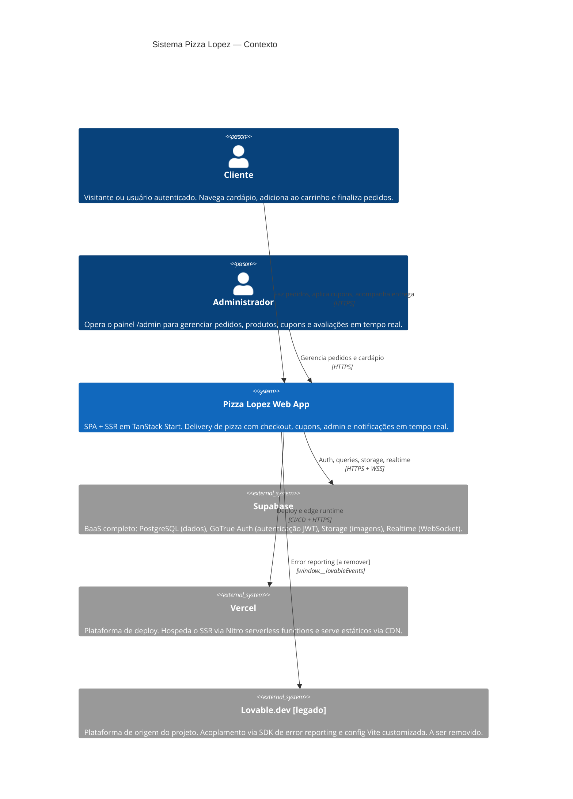

# C4 — Contexto (Nível 1) — Pizza Lopez

> Gerado pelo Architect em 2026-06-08

## Sistemas externos — detalhamento

| Sistema | Tipo | Protocolo | Criticidade |
|---------|------|-----------|-------------|
| **Supabase** | BaaS | HTTPS REST + WSS | 🔴 Crítico — sem Supabase, nada funciona |
| **Vercel** | PaaS | HTTPS + edge | 🟡 Alto — deploy e SSR |
| **Lovable.dev** | SDK legado | `window.__lovableEvents` | 🟢 Baixo — apenas error reporting, removível |
| **Gateway de Pagamento** | — | — | 🔴 **NÃO INTEGRADO** — lacuna no sistema |
