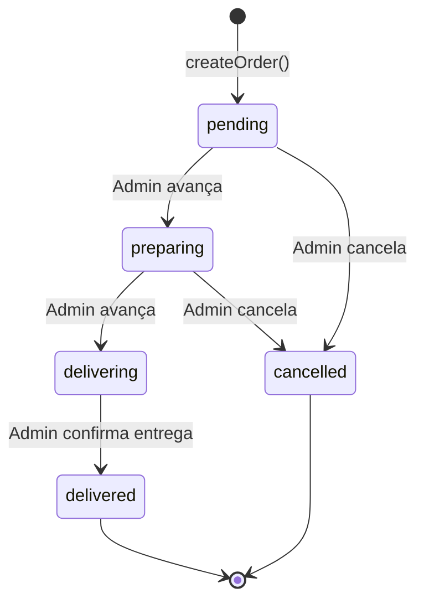
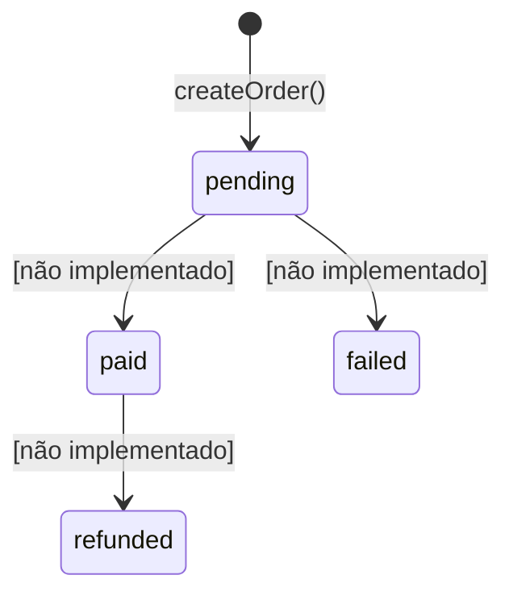
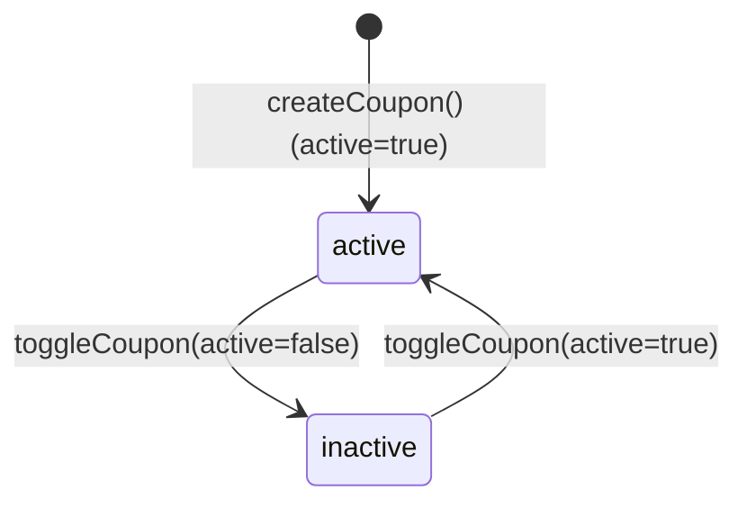

# Máquinas de Estado — Pizza Lopez

> Gerado pelo Detective em 2026-06-08

## Escala de confiança
- 🟢 CONFIRMADO — extraído diretamente do código
- 🟡 INFERIDO — baseado em padrões

---

## 1. Status do Pedido (`Order.status`)

**Valores possíveis:** `pending`, `preparing`, `delivering`, `delivered`, `cancelled`

**Transições permitidas** (definidas em `nextStatuses` em `routes/admin.tsx`):

| De → Para | Gatilho | Quem executa | Confiança |
|-----------|---------|-------------|-----------|
| `[*]` → `pending` | `createOrder()` | Sistema (automático) | 🟢 |
| `pending` → `preparing` | `updateOrderStatus` | Admin (manual) | 🟢 |
| `pending` → `cancelled` | `updateOrderStatus` | Admin (manual) | 🟢 |
| `preparing` → `delivering` | `updateOrderStatus` | Admin (manual) | 🟢 |
| `preparing` → `cancelled` | `updateOrderStatus` | Admin (manual) | 🟢 |
| `delivering` → `delivered` | `updateOrderStatus` | Admin (manual) | 🟢 |
| `delivered` → *nenhum* | — | Estado terminal | 🟢 |
| `cancelled` → *nenhum* | — | Estado terminal | 🟢 |

> 🔴 **LACUNA:** Não há notificação ao cliente quando o status muda. O realtime só é consumido no painel admin.

---

## 2. Status de Pagamento (`Order.payment_status`)

**Valores possíveis:** `pending`, `paid`, `failed`, `refunded`

**Transições:** 🔴 LACUNA — nenhuma lógica de transição de `payment_status` foi encontrada no código. O campo existe no schema mas nunca é atualizado fora do INSERT inicial como `"pending"`. Provável que integração de pagamento (Pix, gateway) não esteja implementada.

---

## 3. Status do Cupom (`Coupon.active`)

**Valores:** `true` / `false` — toggle simples via `toggleCoupon`

> 🟢 Confirmado via `admin.functions.ts:toggleCoupon`
